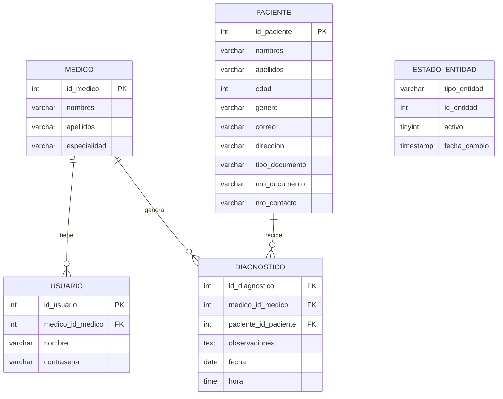

# Diagrama ER (Mermaid)

```mermaid

erDiagram

  MEDICO ||--o{ USUARIO : tiene

  MEDICO ||--o{ DIAGNOSTICO : genera

  PACIENTE ||--o{ DIAGNOSTICO : recibe

  MEDICO {

    int id_medico PK

    varchar nombres

    varchar apellidos

    varchar especialidad
  }

  PACIENTE {

    int id_paciente PK

    varchar nombres

    varchar apellidos

    int edad

    varchar genero

    varchar correo

    varchar direccion

    varchar tipo_documento

    varchar nro_documento

    varchar nro_contacto
  }

  USUARIO {

    int id_usuario PK

    int medico_id_medico FK

    varchar nombre

    varchar contrasena
  }

  DIAGNOSTICO {

    int id_diagnostico PK

    int medico_id_medico FK

    int paciente_id_paciente FK

    text observaciones

    date fecha

    time hora
  }

  ESTADO_ENTIDAD {
    varchar tipo_entidad

    int id_entidad

    tinyint activo
    
    timestamp fecha_cambio
  }
```
